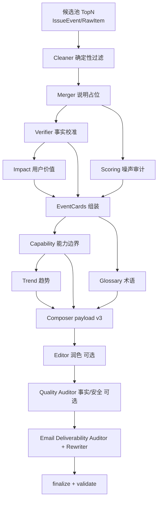

# 多 Agent 周报生产模式（v1，组装式）

本文件定义 AI Pulse 的“多 Agent 分工”架构，用于提升周报的专业性与可控性。

本模式选择 **方案 2：结构化摘要 + 模板组装**（而非一次性自由写作长文），目标是做到 **快 + 够准**，并可追溯到事实来源与评分依据。

## 0. 目标与约束

- **输入**：本周期（周）事件集合（建议 Top20 候选），每条事件包含来源、热度信号、评分拆解与基础事实字段。
- **输出**：
  - `payload.json`：用于邮件渲染的结构化周报（simple/normal/glossary）
  - `audit_report.json`：审计报告（事实冲突、可信度风险、重复合并、评分异常）
- **约束**：
  - 只允许“结构化改写”，不允许无依据的新增事实（每个事实必须可追溯到 source URL）
  - 生成速度优先于完美：允许少量信息缺失，但必须在 audit_report 标注

相关文档：

- 评分规范：`docs/SCORING_V1.md`
- 社媒白名单：`docs/SOCIAL_SOURCES.md`

## 1. 总体流程（每周批处理）

1) **Ingest + Normalize**（抓取与标准化）
   - 产出 `raw_items` 或 `event_candidates`（建议已去重/合并成事件实体）
2) **Score + Candidate Select**（评分与候选池）
   - 按基础分 \(S\) 排序，选出候选 **Top20**
3) **并行 Agent 处理（多工种）**
4) **Orchestrator 合并组装**（模板化组装 payload）
5) **Copy Editor 收口**（语言统一、长度约束、格式）
6) **产出 payload + audit_report**

### 1.1 依赖关系（DAG）

与 **PRD §6.3** 对齐的实现（代码：`backend/app/services/multi_agent_orchestrator.py`）。抓取与 **IssueEvent** 合并在入库阶段完成，流水线从 Cleaner 起。



> **Composer（实现更新）**：LLM 只输出「精简结构化 JSON」（`simple_lines` / `top3` / `sections` / `tools` / `glossary`）；**不写**嵌套巨型 PRD blob。**capabilities** 由上游 Capability 分析在服务端注入（`slim_weekly_render.slim_merge_to_prd_v3`）。邮件 HTML 仍由 **`digest_builder.render_issue_email`** 确定性渲染。**送达率审核**优先基于「渲染后的 HTML + 纯文本节选」，而非整份 payload JSON。

> 说明：**Cleaner** 为 Python 规则；**Merger** 不在此二次合并（见 `artifacts.merger`）。**Capability** 独立 LLM；**Composer** 生成整份 PRD v3；**Editor**（`MULTI_AGENT_ENABLE_EDITOR`）与 **Quality Auditor**（`MULTI_AGENT_ENABLE_AUDITOR`，事实与编造风险）默认均为关。**Email Deliverability**（`MULTI_AGENT_ENABLE_DELIVERABILITY`，默认 **开启**）：链接清洗（去常见 tracking 参数）后，用 **`render_issue_email` 预览 HTML/纯文本** 再做 LLM 送达率审核与按需改写；详见 `app/services/deliverability_pipeline.py`。若开启 **`MULTI_AGENT_DELIVERABILITY_STRICT`**（默认 true）且改写后仍低于 `MULTI_AGENT_DELIVERABILITY_MIN_SCORE` 或仍为 high risk，则整包回退为确定性组装。

## 2. 核心理念：事件卡片（Event Card）

组装式的最小单元是“事件卡片”，它不是一段自由文章，而是可验证的结构化信息。

### 2.1 EventCard（输出最小结构）

```json
{
  "event_id": "string",
  "title": "string",
  "url": "string",
  "published_at": "ISO-8601 string or null",
  "one_liner": "一句话：发生了什么（<= 40 中文字优先）",
  "impact_bullets": ["对谁有什么影响（2-3条）"],
  "evidence": [
    { "label": "official|social|github|media", "url": "string", "quote": "可引用句（可空）" }
  ],
  "confidence": {
    "level": "high|medium|low",
    "reasons": ["trusted_account", "official_post", "multi_media", "single_source", "rumor_risk"]
  },
  "score": {
    "base_S": 0,
    "impact_detail": { "social": 0, "github": 0, "consensus": 0 },
    "notes": ["score notes..."]
  },
  "tags": ["model_update|product_launch|policy|infra|open_source|..."]
}
```

> 说明：证据 `evidence` 至少包含 1 个 URL；若无法提供 quote，可为空但仍需 URL。

## 2.2 最终交付物：payload.json（严格 schema）

最终的 `payload.json` 必须与邮件渲染层的结构一致（simple/normal/glossary），避免“渲染层猜字段”。

```json
{
  "simple": {
    "lines": [
      { "text": "一句话事件（不超过约 300 字）", "url": "https://..." }
    ],
    "footer": "本周一句话总结（可选）"
  },
  "normal": {
    "top3": [
      { "title": "热点标题", "url": "https://..." }
    ],
    "sections": [
      { "title": "大模型更新|AI工具/产品发布|行业重要动态", "paragraph": "多行文本，允许换行" }
    ]
  },
  "glossary": [
    { "term": "术语", "explain": "≤50字通俗解释" }
  ]
}
```

约束：

- `simple.lines`：3–5 条（推荐 5），每条一句话为主，必须带 `url`（若无则空字符串）。
- `normal.top3`：固定 3 条。
- `normal.sections`：固定 3 个板块（标题必须落在三选一；无内容则允许为空数组，但不推荐）。
- `glossary`：5–12 条。

> 注：关键词提示语（banner）属于“邮件包装层”元信息，不建议写入 payload.json；由发送端根据 matched/not matched 决定。

## 3. Agent 分工（最小有效 6 角色）

### Agent A：Fact Verifier（事实校准）

- **输入**：候选事件列表（Top20）+ 其来源 URL（官网/社媒/媒体/GitHub）
- **输出**：`fact_sheet.json`
- **职责**：
  - 核对关键事实：发布时间、产品/模型名称、是否 GA/beta、关键数字是否一致
  - 标注 `confidence.level` 与原因
  - 发现冲突时，写入 `conflicts[]`（不自行编造结论）

`fact_sheet.json` 示例结构：

```json
{
  "events": [
    {
      "event_id": "string",
      "canonical_title": "string",
      "canonical_url": "string",
      "verified_facts": ["..."],
      "confidence": { "level": "high|medium|low", "reasons": ["..."] },
      "conflicts": [{ "field": "string", "details": "string", "urls": ["..."] }]
    }
  ]
}
```

### Agent B：Impact Analyst（非技术影响解读）

- **输入**：fact_sheet + Top20 事件摘要
- **输出**：`impact_notes.json`
- **职责**：
  - 生成每条事件 `one_liner` + 2-3 条 `impact_bullets`
  - 语气面向非技术职场人，避免技术细节堆砌

### Agent C：Scoring Auditor（评分审计/异常检测）

- **输入**：Top20 评分拆解 + 信号字段
- **输出**：`scoring_findings.json`
- **职责**：
  - 检查是否存在“噪音霸榜”：低可信账号热度极高但缺少共识
  - 检查重复事件：同事件多条来源未合并
  - 输出“建议降权/剔除/合并”的规则化建议（不直接改内容）

### Agent D：Trend Synthesizer（趋势归纳）

- **输入**：Top20 EventCard 草稿 + 评分/信号
- **输出**：`trend_section.json`
- **职责**：
  - 提炼 1–3 个趋势结论（每个趋势至少引用 2–3 个事件作为证据）
  - 给出“普通人/企业”的意义解读

### Agent E：Glossary Builder（术语表）

- **输入**：normal 版草稿（或 EventCard 汇总文本）
- **输出**：`glossary.json`
- **职责**：
  - 5–12 个术语，每条 ≤50 字解释
  - 避免“百科式”，以“这周为什么要知道它”为导向

### Agent F：Copy Editor（语言与结构收口）

- **输入**：Orchestrator 组装后的 payload 草稿 + audit findings
- **输出**：`payload.json`
- **职责**：
  - 统一语气、去重、修正不通顺表达
  - **不允许改事实**：涉及事实的句子只能在已验证事实范围内改写
  - 约束长度：
    - simple：3–5 条（建议 5），每条一句话
    - normal：Top3 + 3 个板块（大模型更新 / 工具产品 / 行业动态）

## 4. Orchestrator（合并与仲裁规则）

### 4.1 合并原则

- 以 `event_id` 为主键合并各 Agent 输出
- 任何事实字段必须来自 Fact Verifier 或 evidence URL

### 4.2 冲突仲裁

当出现冲突（A 与 B/D 观点不一致）：

1) **事实冲突优先**：以 Agent A 的 verified_facts 为准
2) **不确定则降级**：
   - `confidence=low` 的事件不得进入 normal Top3
   - 可以进入 sections，但必须标注“信息待验证/以官方后续为准”（一句话内）
3) **无法校准则剔除**：若核心事实无法验证且争议大，移出 TopN

### 4.3 TopN 选择

- **候选池**：Top20（按基础分 S）
- **Simple**：从 Top20 选 5 条（可结合“关键词优先”逻辑）
- **Normal Top3**：从 Top20 选 3 条，要求 `confidence != low`
- **Sections**：按 tags 分类填充（每段 3–5 条卡片）

## 5. Prompt 模板（可复用骨架）

> 这里给出“可直接用”的骨架，具体字段可根据实现调整。

### Fact Verifier Prompt（骨架）

- 输入：Top20 事件（title/summary/url）+ 可访问链接列表
- 输出：严格 JSON，包含 verified_facts/confidence/conflicts
- 规则：不得编造；引用必须来自链接；不确定写 conflicts

### Impact Analyst Prompt（骨架）

- 输入：fact_sheet + 事件摘要
- 输出：每条 event 的 one_liner + impact_bullets
- 规则：非技术表达；避免过度承诺；控制句长

### Trend Synthesizer Prompt（骨架）

- 输入：事件卡片集合（含 tags 与 one_liner）
- 输出：1–3 个趋势，每个趋势列出证据 event_id

### Copy Editor Prompt（骨架）

- 输入：组装后的 payload 草稿
- 输出：最终 payload.json（严格 JSON）
- 规则：不改事实、只改表达；满足结构与长度约束

## 6. 质量门槛（自动验收）

- JSON 可解析、字段齐全
- simple lines 数量在 3–5
- normal Top3 数量 = 3
- glossary 术语数量 5–12，单条解释 ≤50 字（中文字符近似）
- audit_report 中不得出现未处理的 high-severity 冲突

## 7. 失败降级策略（保证每周可出报）

任何单个 Agent 失败都不应阻断整条流水线（除非基础抓取/评分全失败）。

- **Agent A 失败**：直接将所有事件 `confidence=low`，normal Top3 从候选中选“来源覆盖最多”的 3 条；audit_report 标记“未校准事实”。
- **Agent B 失败**：`one_liner` 退化为 “title（url）”，`impact_bullets` 留空或用模板句；Copy Editor 负责语气统一。
- **Agent C 失败**：跳过审计，但保留“低可信上限、时效衰减”等硬规则；audit_report 标记“未审计评分异常”。
- **Agent D 失败**：趋势段落可省略或用 1 句“本周趋势以实用化/工具化为主（待补充）”占位。
- **Agent E 失败**：术语表可降级为 0–3 条（从标题中抽取高频术语），并在 audit_report 标记“术语表未完善”。
- **Agent F 失败**：由 Orchestrator 直接输出 payload 草稿（不做润色），但必须保证 JSON 可解析、结构合规。

