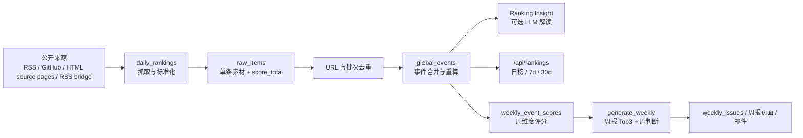

# AI Pulse 核心链路与可观测性

本文档解释 AI Pulse 如何从公开信息源抓取素材，经过清洗、去重、事件合并、评分、排序，最后输出日榜、7 日/30 日榜和周报 Top3。它也说明每个环节应该完成什么，失败时怎么降级，以及上线后如何观察系统是否健康。

如果只想看分数公式，可直接读 [`SCORE_AND_RANKING.md`](SCORE_AND_RANKING.md)。本文重点是完整生产链路。

## 总览



生产默认节奏见 [`deploy/crontab.example`](../deploy/crontab.example)：

| 时间（Asia/Shanghai） | 任务 | 作用 |
| --- | --- | --- |
| 每天 02:10 | `python -m app.jobs.daily_rankings` | 抓取新信息，写入 `raw_items`，合并/重算 `global_events`。 |
| 每天 02:40 | `python -m app.jobs.enrich_rankings --limit 80` | 可选，为高分事件补充中文解读字段。 |
| 周一 04:10 | `python -m app.jobs.generate_weekly` | 基于上一自然周事件计算 `weekly_score` 并生成周报。 |
| 周一 05:00 | `python -m app.jobs.send_weekly` | 给订阅用户发送周报。 |

## 一、采集：把外部信息变成标准素材

入口：`backend/app/jobs/daily_rankings.py`

核心函数：`collect_all_feed_items_with_reports(...)`

这个环节要完成三件事：

1. 从配置的官方 RSS、媒体 RSS、GitHub、HTML source pages 或 RSS bridge 抓取条目。
2. 把不同来源标准化成统一 dict：`source_type`、`source`、`title`、`summary`、`link`、`published_at`、`heat_score`、`metrics` 等。
3. 为每个 feed 生成 `FeedCrawlReport`，记录抓取状态、HTTP 状态码、解析状态、条目数量、耗时和错误信息。

产物：

| 产物 | 说明 |
| --- | --- |
| 内存中的 `items` | 即将进入去重和评分的候选素材。 |
| `feed_crawl_runs` | 每个 feed 的抓取健康记录，用于诊断坏源、空源、解析失败。 |
| 日志 `[feed-health] ...` | 命令行和 systemd journal 中的即时健康线索。 |

常见失败与处理：

| 情况 | 系统行为 | 后续处理 |
| --- | --- | --- |
| 单个 feed 请求失败 | 标记 `fetch_failed`，记录错误，其他 feed 继续。 | 查 `feed_crawl_runs.error_message`，必要时替换或移除该源。 |
| HTTP 成功但返回 HTML | 标记 `invalid_feed`。 | 说明 URL 不是 RSS/Atom，换成真实 feed 地址。 |
| RSS 可解析但没有 entry | 标记 `empty_feed`。 | 可能是源短期无更新，连续出现再治理。 |
| entry 全被过滤 | 标记 `all_filtered`。 | 检查该源是否标题/链接缺失或解析格式变化。 |
| 抓到内容但最终没有新入库 | 标记 `no_new_items`。 | 正常情况，表示全是重复或已见过内容。 |

观测方式：

```sql
SELECT run_id, feed_channel, health_status, COUNT(*) AS n
FROM feed_crawl_runs
WHERE run_at >= NOW() - INTERVAL 1 DAY
GROUP BY run_id, feed_channel, health_status
ORDER BY run_id DESC, n DESC;

SELECT feed_channel, feed_url, health_status, http_status, error_class, LEFT(error_message, 200) AS error_message
FROM feed_crawl_runs
WHERE run_at >= NOW() - INTERVAL 1 DAY
  AND health_status NOT IN ('ok', 'no_new_items', 'skipped_duplicate_feed')
ORDER BY run_at DESC
LIMIT 50;
```

辅助脚本：

```bash
cd backend
python scripts/rss_source_governance.py --days 7
```

## 二、去重与入库：只让新素材进入 raw_items

入口：`filter_new_items_for_daily_rankings(...)`

这个环节要完成三件事：

1. 规范化 URL，去掉常见追踪参数。
2. 在同一批次内去掉重复条目。
3. 与数据库里已有 `raw_items` 对比，跳过已入库素材。

产物：

| 产物 | 说明 |
| --- | --- |
| `raw_items` | 原始素材表；每日榜路径下 `issue_id` 为空。 |
| `normalized_link` / `normalized_link_hash` | URL 去重辅助字段。 |
| `score_total` / `score_breakdown_json` | 单条素材规则分和分项说明。 |
| `extra_json` | feed URL、source name、metrics、raw_text、GitHub 元信息等扩展字段。 |

失败与处理：

| 情况 | 系统行为 | 后续处理 |
| --- | --- | --- |
| 本轮没有抓到任何 items | `daily_rankings` 打印 `no feed items collected`，保存抓取报告后退出。 | 优先查 feed 健康，而不是查评分逻辑。 |
| 全部是重复素材 | 打印 `all collected items skipped`，保存 `no_new_items` 状态后退出。 | 通常正常；若连续多天如此，检查源配置是否太窄。 |
| 数据库缺列 | 插入或后续任务会报 ORM/SQL 错误。 | 执行 `sql/schema.sql` 或对应 migrations，见 `docs/部署与数据说明.md`。 |

观测方式：

```sql
SELECT COUNT(*) AS raw_daily_items
FROM raw_items
WHERE issue_id IS NULL
  AND created_at >= NOW() - INTERVAL 1 DAY;

SELECT source_type, COUNT(*) AS n, MAX(score_total) AS max_score
FROM raw_items
WHERE issue_id IS NULL
  AND created_at >= NOW() - INTERVAL 1 DAY
GROUP BY source_type
ORDER BY n DESC;
```

## 三、单条素材评分：判断素材本身有没有价值

入口：`backend/app/services/scoring_service.py`

`score_item(...)` 对每条 `raw_item` 打一个确定性规则分 `score_total`。它不是最终榜单分，但会进入后续 `user_value` 分量。

当前分量：

| 分量 | 权重 | 判断方向 |
| --- | ---: | --- |
| `practical` | 30 | 是否发布、上线、可用、和工作流/工具相关。 |
| `accessible` | 20 | 是否开源、低门槛、免费；需要 API/部署/训练会扣一些。 |
| `impact` | 20 | 用 `heat_score` 和 GitHub stars 等做影响力代理。 |
| `opportunity` | 15 | 是否有商业、企业、B2B、赚钱机会。 |
| `maturity` | 10 | GA/production 加分，paper/beta/research 偏早期会扣分。 |
| `trend` | 5 | 是否体现轻量化、成本、Agent、workflow 等趋势。 |

另有 `source_tier` 信任加分。分项会写入 `raw_items.score_breakdown_json`，方便审计。

观测方式：

```sql
SELECT id, source, source_type, score_total, title
FROM raw_items
WHERE issue_id IS NULL
ORDER BY id DESC
LIMIT 20;
```

## 四、事件合并：把多篇报道合成一个 global_event

入口：`upsert_global_events_from_raw_items(...)`

核心表：

| 表 | 作用 |
| --- | --- |
| `global_events` | 事件主表，一件事一行，用于榜单和周报。 |
| `global_event_sources` | 事件与原始素材/来源 URL 的关系表。 |

这个环节要完成四件事：

1. 用规范化 URL 或标题稳定 key 查找已有事件。
2. 如果没有稳定 key 命中，再在最近活跃事件里用标题相似度合并。当前阈值约 `0.82`，时间窗约 `72` 小时。
3. 新来源并入同一事件，增加来源记录，更新 `last_seen_at`。
4. 重算事件级分数、来源数、首发时间和展示字段。

关键口径：

- `published_at` 表示故事首发时间，使用所有来源中的最早时间。
- 后续跟进稿不会把旧故事刷成新故事；它只会增加 `source_count`、影响 Pulse 的 `source_mix`，并更新 `last_seen_at`。
- `last_seen_at` 表示最近一次被采集/合并看到，用于 7d/30d 和周报候选窗。

失败与处理：

| 情况 | 系统行为 | 后续处理 |
| --- | --- | --- |
| 单条事件重算失败 | 捕获异常并写日志，其他事件继续。 | 查 `recalculate_global_event failed id=...`，必要时对该事件或全量重算。 |
| 标题翻译失败 | 记录 warning，事件仍保留原题。 | 修复 LLM 配置后跑 `backfill_title_zh`。 |
| 误合并或漏合并 | 现阶段主要依赖 URL + 标题相似度规则。 | 用 `global_event_sources` 检查来源；必要时调整阈值或做数据修正。 |

观测方式：

```sql
SELECT id, title_zh, canonical_title, category, source_count, ranking_score, published_at, last_seen_at
FROM global_events
WHERE status = 'active'
ORDER BY updated_at DESC
LIMIT 20;

SELECT ge.id, ge.title_zh, COUNT(ges.id) AS sources
FROM global_events ge
JOIN global_event_sources ges ON ges.global_event_id = ge.id
GROUP BY ge.id, ge.title_zh
ORDER BY sources DESC
LIMIT 20;
```

修复命令：

```bash
cd backend
python -m app.jobs.recalculate_global_events --dry-run
python -m app.jobs.recalculate_global_events --apply
```

## 五、事件级评分：Pulse 和综合排序分

入口：`backend/app/services/ranking_score.py`

事件级评分分两层：

| 名称 | 是否含新鲜度 | 用途 |
| --- | --- | --- |
| `ranking_score` | 含，25% freshness | 存库综合分、审计、历史兼容。 |
| `Pulse` / `pulse_score` | 不含 freshness | 今日榜主展示、事件详情主分。 |
| `effective_ranking_score` | Pulse 乘以轻量时间衰减 | 7d/30d 榜单排序和展示。 |

`ranking_score` 公式：

```text
0.30*trust + 0.25*freshness + 0.20*heat + 0.15*source_mix + 0.10*user_value
```

Pulse 公式：

```text
(0.30*trust + 0.20*heat + 0.15*source_mix + 0.10*user_value) / 0.75
```

分量来源：

| 分量 | 怎么来 |
| --- | --- |
| `trust` | 根据 dominant `source_type` 映射，官方源最高，社区/社交较低。 |
| `freshness` | 距首发 `published_at` 越近越高。 |
| `heat` | `heat_score` 归一化。 |
| `source_mix` | 独立来源数递减加分。 |
| `user_value` | 从 raw `score_total` 压缩映射；Ranking Insight 可覆盖。 |

观测方式：

```sql
SELECT id, title_zh, ranking_score, trust_score, freshness_score, user_value_score, source_count, heat_score
FROM global_events
WHERE status = 'active'
ORDER BY ranking_score DESC
LIMIT 20;

SELECT id, JSON_EXTRACT(metrics_json, '$.score_breakdown') AS score_breakdown
FROM global_events
WHERE status = 'active'
ORDER BY ranking_score DESC
LIMIT 10;
```

## 六、Ranking Insight：把事件分数变成用户能读懂的解释

入口：

```bash
python -m app.jobs.enrich_rankings --limit 10
```

也可以由 `daily_rankings` 在 `RANKING_INSIGHT_ENABLED=true` 时顺带触发。

这个环节要完成三件事：

1. 从高分 active `global_events` 中选候选。
2. 调 OpenAI-compatible Chat Completions API，生成 `what_happened`、`why_important`、`what_it_means_for_you`、`action_suggestion`、能力标签等。
3. 写入 `global_events` 与 `metrics_json.ranking_insight`，供事件详情页和周报 Top3 复用。

失败与处理：

| 情况 | 系统行为 | 后续处理 |
| --- | --- | --- |
| LLM 未配置 | enrichment 不执行或返回 0；榜单仍可用。 | 配置 `LLM_API_KEY`、`LLM_API_BASE`、`LLM_MODEL` 后重跑。 |
| LLM 调用失败 | `daily_rankings` 捕获异常并继续；独立 `enrich_rankings` 会在日志暴露错误。 | 降低 limit、检查额度/网络/模型名。 |
| 某事件没被 enrich | 仍有 fallback 摘要，但详情和周报文案会短一些。 | 用 `--force` 或提高 `RANKING_INSIGHT_LIMIT`。 |

观测方式：

```sql
SELECT id, title_zh, action_suggestion,
       JSON_EXTRACT(metrics_json, '$.ranking_insight.applied') AS insight_applied
FROM global_events
WHERE status = 'active'
ORDER BY ranking_score DESC
LIMIT 30;
```

## 七、日榜、7 日榜、30 日榜由什么决定

入口：`GET /api/rankings?range=today|7d|30d`

实现：`backend/app/routers/rankings_public.py`

| 榜单 | 入选条件 | 排序依据 | 产品含义 |
| --- | --- | --- | --- |
| 今日榜 `today` | `published_at` 落在昨日上海自然日 `[00:00, 24:00)` | Pulse 降序 | 昨天新发生、今天值得看的事件。 |
| 7 日榜 `7d` | `published_at >= now-7d` 或 `last_seen_at >= now-7d` | `Pulse * 7d_time_decay` | 最近 7 天仍值得关注的事件，旧事件有新来源也可出现。 |
| 30 日榜 `30d` | `published_at >= now-30d` 或 `last_seen_at >= now-30d` | `Pulse * 30d_time_decay` | 最近一个月的重要事件回看。 |

为什么今日榜不直接按 `ranking_score` 排？

- `ranking_score` 已经含 freshness。
- 今日榜候选本来就限定在同一个自然日，再把 freshness 强加入排序会让发布时间差异过度影响结果。
- 所以今日榜用去掉 freshness 的 Pulse 排序，更强调可信度、热度、多源和用户价值。

为什么 7d/30d 用 `effective_ranking_score`？

- 跨多天时需要轻量时间衰减，避免一个很早的高分事件长期压住新事件。
- 衰减底数仍是 Pulse，避免把 freshness 算两遍。

观测方式：

```bash
curl -s "https://YOUR_DOMAIN/api/rankings?range=today&category=all&limit=5"
curl -s "https://YOUR_DOMAIN/api/rankings?range=7d&category=all&limit=5"
curl -s "https://YOUR_DOMAIN/api/rankings?range=30d&category=all&limit=5"
```

API 会返回：

| 字段 | 含义 |
| --- | --- |
| `sort_by` | 当前列表实际排序字段，today 为 `pulse_score`，7d/30d 为 `effective_ranking_score`。 |
| `pulse_score` | 去 freshness 的稳定事件分。 |
| `effective_ranking_score` | 带时间衰减的 7d/30d 综合分。 |
| `stored_ranking_score` | 数据库存储的含 freshness 综合分，主要用于审计。 |

## 八、周榜/周报 Top3 由什么决定

这里的“周榜”主要体现在周报 Top3 与 `weekly_event_scores` 表。当前前端公开页展示的是周报，不是单独的周排行榜页面。

入口：

```bash
python -m app.jobs.generate_weekly
```

周报覆盖窗口：

- `period_start` 是发行周一。
- 内容覆盖上一自然周：上周一 00:00 到本周一 00:00，按 Asia/Shanghai 解释。
- 候选事件必须 `last_seen_at` 落在这个周窗内。

`weekly_score` 公式：

```text
weekly_score = min(100, max_pulse_score + source_boost + active_day_boost + authority_boost)
```

| 分量 | 含义 |
| --- | --- |
| `max_pulse_score` | 事件当前可观测分数上界，取 stable Pulse、存库 ranking_score、关联 raw score_total 的近似最大值。 |
| `source_boost` | 独立来源越多，加分越高，上限递减。 |
| `active_day_boost` | 一周内跨越多个自然日被报道，说明持续发酵。 |
| `authority_boost` | 官方域或权威媒体域参与报道会加分。 |

Top3 口径：

- 先重算 `weekly_event_scores`。
- 默认按 `weekly_score DESC, global_event_id ASC` 选 Top3。
- 周报的本周判断、能力边界、术语可用 LLM 生成；如果 LLM 不可用，会使用确定性 fallback。
- 周报 Top3 卡片上的“发生了什么 / 为什么重要 / 对你意味着什么”优先复用 Ranking Insight。如果日榜 Insight 没跑，Top3 仍能上榜，但文案会更短。

失败与处理：

| 情况 | 系统行为 | 后续处理 |
| --- | --- | --- |
| 缺少迁移表 | `generate_weekly` 会提前报错并提示缺哪个 migration。 | 执行对应 SQL migration。 |
| 候选不足 3 条 | `allow_short_top3=true`，周报可短 Top3。 | 检查 daily pipeline 是否正常、周窗是否有 active 事件。 |
| 单个 weekly score upsert 失败 | 记录 warning，其他事件继续。 | 查日志 `weekly_event_score upsert failed ge=...`。 |
| LLM 未配置或失败 | Top3 仍由分数产生；thesis/capability/glossary 使用 fallback 或为空。 | 配置 LLM 后 `generate_weekly --force`。 |
| 周报已生成 | 默认跳过，避免重复覆盖。 | 使用 `--force` 或 `GENERATE_WEEKLY_FORCE=1` 重跑。 |

观测方式：

```sql
SELECT period_start, global_event_id, weekly_score, max_pulse_score,
       independent_source_count, active_days, source_boost, active_day_boost,
       authority_boost, score_reasons
FROM weekly_event_scores
WHERE period_start = '2026-06-15'
ORDER BY weekly_score DESC
LIMIT 20;

SELECT id, period_start, status, ready_at
FROM weekly_issues
ORDER BY ready_at DESC, created_at DESC
LIMIT 5;
```

API 与页面检查：

```bash
curl -s "https://YOUR_DOMAIN/api/weekly/latest"
curl -s "https://YOUR_DOMAIN/api/archive?limit=10"
```

## 九、发布与发送

周报生成后会写入：

| 表/文件 | 作用 |
| --- | --- |
| `weekly_issues.payload_json` | 周报结构化 payload。 |
| `weekly_issues.simple_text` / `normal_text` / `glossary_json` | 兼容展示和邮件渲染的文本产物。 |
| 周报公开页 | 由 `publish_weekly_report(...)` 生成并可通过 `/weekly/latest` 或 `/weekly/:date` 访问。 |
| `send_logs` | 发送去重和历史记录。 |
| `weekly_click_logs` | 邮件打开、点击、落地页浏览等追踪。 |

发送失败通常不影响已生成的周报页面。先确认周报 ready，再排查 SMTP、订阅者状态和 `send_logs`。

观测方式：

```sql
SELECT id, email, status, created_at
FROM subscribers
ORDER BY created_at DESC
LIMIT 20;

SELECT issue_id, kind, COUNT(*) AS sent_count, MAX(sent_at) AS last_sent_at
FROM send_logs
GROUP BY issue_id, kind
ORDER BY last_sent_at DESC
LIMIT 20;

SELECT report_date, event_type, click_target, COUNT(*) AS n
FROM weekly_click_logs
WHERE created_at >= NOW() - INTERVAL 14 DAY
GROUP BY report_date, event_type, click_target
ORDER BY report_date DESC, n DESC;
```

## 十、整体失败策略

AI Pulse 当前是批处理系统，不是强事务工作流。设计目标是：单源、单条事件、单个 LLM 调用失败时，不拖垮整条链路。

| 层级 | 失败隔离方式 | 可恢复方式 |
| --- | --- | --- |
| 单个信源 | 记录 `feed_crawl_runs`，其他信源继续。 | 修复源 URL 后下次自动恢复。 |
| 单条素材 | 被去重或评分异常时不影响其他素材。 | 查 raw item 与日志，必要时重跑 daily。 |
| 单个事件重算 | 捕获异常，其他事件继续。 | 修复数据后跑 `recalculate_global_events --apply`。 |
| Ranking Insight | 可选；失败不影响榜单排序。 | 修复 LLM 后跑 `enrich_rankings --force`。 |
| 周报 LLM | 可选；Top3 仍由 `weekly_score` 产生。 | 修复 LLM 后 `generate_weekly --force`。 |
| 邮件发送 | 不影响公开周报页面。 | 修复 SMTP/订阅状态后重跑 `send_weekly --test` 或正式发送。 |

## 十一、上线后最小巡检清单

每天看：

```bash
curl -s "https://YOUR_DOMAIN/api/health"
curl -s "https://YOUR_DOMAIN/api/rankings?range=today&category=all&limit=5"
sudo journalctl -u aipulse-api -n 200 --no-pager
tail -n 200 /var/log/aipulse-daily.log
tail -n 200 /var/log/aipulse-enrich.log
```

每周一看：

```bash
tail -n 200 /var/log/aipulse-generate.log
tail -n 200 /var/log/aipulse-send.log
curl -s "https://YOUR_DOMAIN/api/weekly/latest"
```

数据库快速检查：

```sql
SELECT COUNT(*) FROM raw_items WHERE issue_id IS NULL AND created_at >= NOW() - INTERVAL 1 DAY;
SELECT COUNT(*) FROM global_events WHERE updated_at >= NOW() - INTERVAL 1 DAY;
SELECT health_status, COUNT(*) FROM feed_crawl_runs WHERE run_at >= NOW() - INTERVAL 1 DAY GROUP BY health_status;
SELECT period_start, COUNT(*) FROM weekly_event_scores GROUP BY period_start ORDER BY period_start DESC LIMIT 4;
```

## 十二、当前可观测性的边界

已有：

- `/health` 和 `/api/health` 只做 API 存活检查。
- `feed_crawl_runs` 能看信源级健康。
- `raw_items`、`global_events`、`global_event_sources` 能审计从素材到事件的关系。
- `metrics_json.score_breakdown` 能审计事件分数分量。
- `weekly_event_scores.score_reasons` 能审计周榜/周报 Top3 原因。
- 周报生成会输出 quality line 和 audit 信息。
- 后台有订阅者、统计、反馈相关页面和 API。

不足：

- 目前没有统一的任务运行表记录每个 cron job 的开始、结束、退出码。
- `/health` 不检查数据库、LLM、SMTP、最近一次抓取是否成功。
- 没有 Prometheus/Grafana 指标导出。
- 日榜 API 是实时计算排序，没有把每次榜单快照单独落表。

建议后续增强：

1. 增加 `job_runs` 表，记录 job name、run_id、status、started_at、finished_at、error。
2. 增加 `/api/health/deep`，检查数据库连接、最近一次 `daily_rankings`、最近一次周报生成。
3. 为 feed 失败率、每日入库量、事件重算失败数、LLM 成功率、邮件发送成功率增加指标。
4. 将每日 TopN 榜单快照落表，方便回放某天榜单和解释历史变化。

## 相关代码入口

| 环节 | 主要文件 |
| --- | --- |
| 采集与每日任务 | `backend/app/jobs/daily_rankings.py`, `backend/app/services/crawler_service.py` |
| 抓取健康 | `backend/app/services/feed_crawl_report.py`, `backend/scripts/rss_source_governance.py` |
| raw 去重 | `backend/app/services/raw_item_dedupe.py`, `backend/app/utils/url_dedupe.py` |
| raw 评分 | `backend/app/services/scoring_service.py` |
| 事件合并 | `backend/app/services/global_event_service.py` |
| 事件排序分 | `backend/app/services/ranking_score.py` |
| Ranking Insight | `backend/app/services/ranking_insight_service.py`, `backend/app/jobs/enrich_rankings.py` |
| 日榜 API | `backend/app/routers/rankings_public.py` |
| 周评分 | `backend/app/services/weekly_event_score_service.py` |
| 周报生成 | `backend/app/jobs/generate_weekly.py`, `backend/app/services/weekly_global_pipeline.py` |
| 邮件发送 | `backend/app/jobs/send_weekly.py`, `backend/app/services/email_service.py` |
