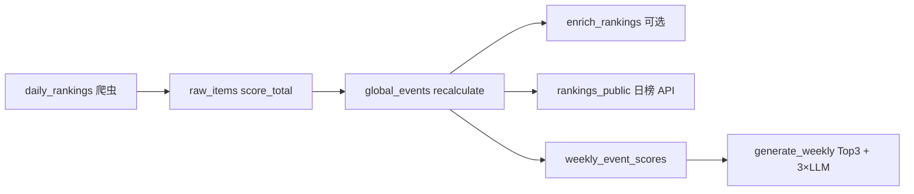

# 分数与榜单口径对照表

本文档是 **线上榜单 / 周刊 / API 展示** 的权威说明。实现以 `backend/app/services/ranking_score.py`、`rankings_public.py`、`weekly_event_score_service.py` 为准。若需要理解从抓取到榜单/周报的完整链路、失败处理和可观测性，请先读 [`PIPELINE_AND_OBSERVABILITY.md`](PIPELINE_AND_OBSERVABILITY.md)。

**与 `docs/SCORING_V1.md` 的关系**：`SCORING_V1.md` 描述的是 **单条 `raw_items` 入库前** 的 6 维规则分（`score_total`），**不是** 日榜 Pulse 或周刊 `weekly_score` 的公式。二者通过 `user_value_from_raw_score(score_total)` 间接关联。

---

## 1. 分数对照总表

| 名称 | 存库 / 计算 | 范围 | 主要用途 | 是否含「新鲜度」 | 代码入口 |
|------|-------------|------|----------|------------------|----------|
| **`score_total`** | `raw_items.score_total` | 0–100+（原始可更高，展示常压到 100） | 入库前单条素材规则分；喂给 `user_value` | 在 SCORING_V1 各维里体现 | `scoring_service.score_item` |
| **`ranking_score`** | `global_events.ranking_score` | 0–100 | 存库综合分、审计、`metrics_json`；**不是** 日榜主排序分 | **是**（25% freshness） | `compute_ranking_score` + `recalculate_global_event` |
| **`Pulse` / `pulse_score`** | 实时算，API 字段 `pulse_score`；`ranking_score` 字段在 API 中与 Pulse **对齐展示** | 0–100 | **今日榜排序与展示**；详情页主分 | **否** | `stable_pulse_score_for_global_event` |
| **`effective_ranking_score`** | 实时算，API 返回 | 0–100 | **7d / 30d 榜**排序与「综合分」列展示 | 通过乘子体现故事年龄（见 §3） | `effective_ranking_score_for_event` |
| **`weekly_score`** | `weekly_event_scores.weekly_score` | 0–100 | **周刊候选池 + Top3 名单** | 周维度用 `active_days` 等，不是日榜 freshness | `calculate_weekly_score` |
| **`top3_score`** | 不存 global 主表 | 0–100 | **仅 legacy 多 Agent 周刊**选题 | 含 freshness 分量 | `top3_selector.calculate_top3_score` |

### 1.1 `ranking_score` 与 Pulse 的分量权重

**`ranking_score`（存库）**：

```
0.30×trust + 0.25×freshness + 0.20×heat + 0.15×source_mix + 0.10×user_value
```

**Pulse（日榜主分，去掉 freshness 后按剩余权重重归一）**：

```
(0.30×trust + 0.20×heat + 0.15×source_mix + 0.10×user_value) / 0.75
```

| 分量 | 含义 | 典型来源 |
|------|------|----------|
| trust | 来源类型可信度 | `trust_from_source_type` |
| freshness | 距 **首发** `published_at` 多久 | `freshness_from_published` |
| heat | 热度归一 | `heat_score` → `heat_normalized` |
| source_mix | 独立来源数 | `source_count` → `source_count_component` |
| user_value | 用户价值 | `raw_items.score_total` 映射，或 Insight 写入后覆盖 |

### 1.2 `weekly_score`（周刊）

```
weekly_score = min(100, max_pulse_approx + source_boost + active_day_boost + authority_boost)
```

| 加项 | 含义 |
|------|------|
| `max_pulse_approx` | 当前 GlobalEvent 上 Pulse、`ranking_score`、关联 raw `score_total` 的近似上界（**非**本周历史曲线最高值，见 `compute_max_pulse_score_approx` 注释） |
| `source_boost` | 周内独立来源数 |
| `active_day_boost` | 周内各来源 `published_at` 落在上海周窗内的 **去重自然日**数 |
| `authority_boost` | 是否含官方域 / 权威媒体域 |

---

## 2. 各榜单：过滤窗 + 排序 + 前端展示

| 榜单 | 入选条件（摘要） | 排序依据 | 列表「分数」列 |
|------|------------------|----------|----------------|
| **today** | `published_at` 落在 **昨日上海自然日** `[00:00, 24:00)` | **Pulse** 降序 | Pulse |
| **7d** | `published_at ≥ now-7d` **或** `last_seen_at ≥ now-7d` | **Pulse × 7d 衰减**（综合分） | 综合分（`effective_ranking_score`） |
| **30d** | 同上，30 天 | **Pulse × 30d 衰减** | 综合分 |
| **周刊 Top3** | 发行周一 `period_start` 对应 **上一自然周**（上周一～上周日）内 `last_seen_at` 的事件已算分 | **`weekly_score` 前 3** | 展示含 `weekly_score`、Pulse 等 |

**today 产品语义**：「昨日 **新发** 的故事」，不是「今天又在被讨论的旧故事」。旧题新报道请用 7d/30d 或看详情页多源。

API：`GET /api/rankings?range=today|7d|30d` → 字段见 `rankings_public.py`（`sort_by`、`pulse_score`、`effective_ranking_score`）。

---

## 3. 时间衰减（仅 7d / 30d）

```
effective_ranking_score = Pulse × decay_multiplier(published_at, range)
```

- **底数必须是 Pulse**，不能用 `ranking_score`，否则 freshness 算两次。
- **`published_at` 必须是故事首发时间**（各来源 `published_at` 的 **最小值**），见 §4。

| 窗口 | 衰减策略（当前实现） |
|------|----------------------|
| 7d | 首发 **6 天内**乘子 1.0；第 7 天略降，最低约 **0.96** |
| 30d | 每天约 **0.4%**，30 天最低约 **0.88** |

---

## 4. 为什么 `published_at` 要用 min（最早），而不是 max（最新）？

### 4.1 问题场景（旧逻辑用 max 时）

1. 周三：媒体 A 首发报道 → 事件入库，`published_at = 周三`。
2. 周六：媒体 B 同题跟进 → 合并进同一 `global_event`。
3. 若 `published_at = max(来源)` → 被改成 **周六**。

后果：

- **7d/30d 衰减**：故事被当成「周六新发」，周三首发的高分事件在榜单位置上 **变「更新」了**，不合理。
- **today 窗**：若周六落在「昨日窗」内，**旧闻可能误进今日榜**。
- 与产品叙事冲突：跟进稿应体现为 **多源加分**（`source_count` ↑ → Pulse 的 `source_mix` ↑），而不是 **假装今天才发生**。

### 4.2 现逻辑（min + 多源）

| 动作 | 字段变化 |
|------|----------|
| 后续报道并入 | `published_at` **保持各来源最早**；`source_count` 增加 |
| Pulse | `source_mix` 升高，**故事年龄不变** |
| 7d/30d 综合分 | 仍按 **首发日** 衰减；Pulse 升高可部分抵消衰减 |

实现：`recalculate_global_event` → `ge.published_at = min(来源 published_at)`；`merge_raw_into_global` 同 URL 也只保留更早的源时间。

### 4.3 「历史数据债」是什么意思？

- **代码**已改为 min，但 **库里已有行** 若是在改代码 **之前** 用 max 算出来的，`published_at` 可能仍是「最新跟进日」。
- 在新一天 `daily_rankings` 里，只有 **被触达重算** 的事件会纠正；从未再合并的事件会一直带着旧日期，直到 **批量 `recalculate_global_event`**。

这不是流程设计错误，而是 **一次性数据迁移** 问题。见 `docs/command.md`「批量重算 global_events」。

---

## 5. Ranking Insight 与周刊质量（「耦合」指什么）

**Ranking Insight**（`enrich_rankings` / `daily_rankings` 内可选）：对少量高分 `global_events` 调 LLM，写入：

- `what_happened` / `why_important` / `what_it_means_for_you` / `action_suggestion`
- 可选覆盖 `user_value`（`metrics_json.ranking_insight.applied=true`）

**周刊 Top3 行**（`build_normal_top3_payload_row`）**不另跑 Impact LLM**，直接从上述字段拷贝进 `normal.top3`：

```text
what_happened  ← ge.what_happened（空则退回 summary）
why_important  ← ge.why_important
what_it_means_for_you ← ge.what_it_means_for_you
```

因此：

- Insight **跑得多、跑在周刊生成之前** → 周刊 Top3 卡片 **文案充实**。
- Insight **未跑 / 限额没覆盖到该 event** → Top3 仍会上榜（按 `weekly_score`），但可能只剩 **标题 + 摘要式占位**，观感偏薄。

**「耦合」= 周刊正文质量依赖日榜 Insight 是否已写入，而不是周刊流水线里再生成一遍。** 编排上建议：`daily_rankings` → `enrich_rankings`（可选）→ 周一 `generate_weekly`。

配置：`.env` 中 `RANKING_INSIGHT_ENABLED`、`RANKING_INSIGHT_LIMIT`（默认约 10 条/天）。

---

## 6. 数据流（生产路径）



---

## 7. 已废弃 / 非生产路径（勿与新功能混用）

| 模块 / 配置 | 状态 | 说明 |
|-------------|------|------|
| `WEEKLY_SOURCE=legacy` | **deprecated** | 每期 RSS + 全量 `MultiAgentOrchestrator` |
| `top3_selector.select_top3` + `top3_score` | **legacy 周刊选题** | global slim **不用** |
| `weekly_from_rankings_service.select_global_events_for_weekly` | **未接生产** | 用 `_sort_score` + 类别配额；生产用 `select_global_events_by_weekly_score` |
| `resolve_global_weekly_top3_rows`（LLM 选 Top3） | **可选/未默认** | 生产 `weekly_global_pipeline` 用 `build_normal_top3_payload_rows`（分数 Top3） |
| `effective_ranking_score(ranking_score, …)` 作榜单底数 | **已修正** | 榜单与周刊预排序应使用 Pulse |

---

## 8. 相关文档

| 文档 | 内容 |
|------|------|
| `docs/SCORING_V1.md` | **raw_items** 6 维 `score_total` |
| `docs/MULTI_AGENT_V1.md` | 周刊 slim 流水线、LLM 次数 |
| `docs/WEEKLY_TOP3_PROTOCOL.md` | Top3 payload 字段协议 |
| `docs/command.md` | 运维命令、批量重算 |
