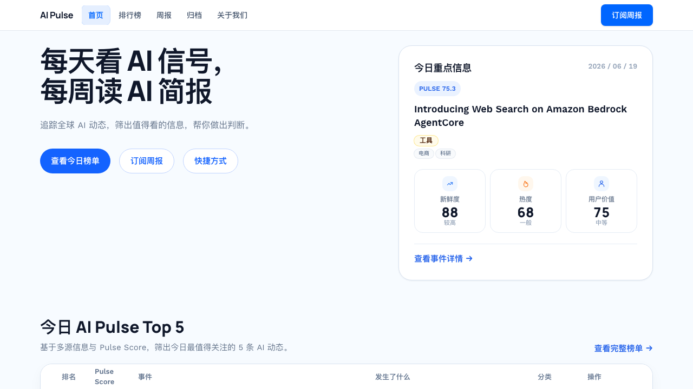
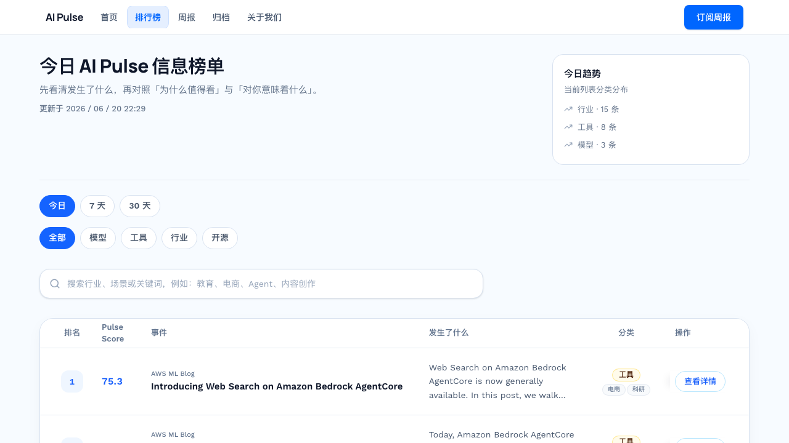
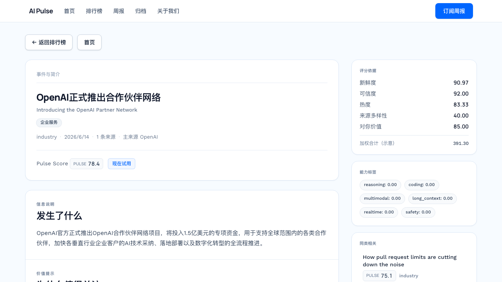
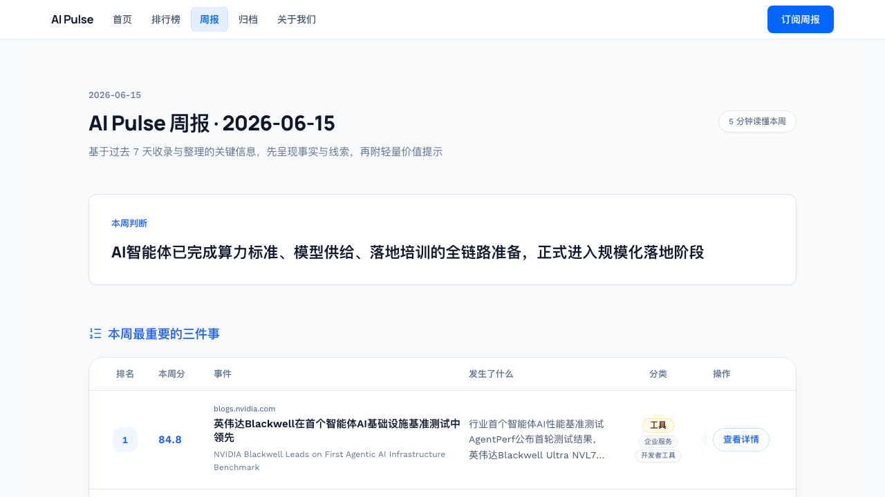
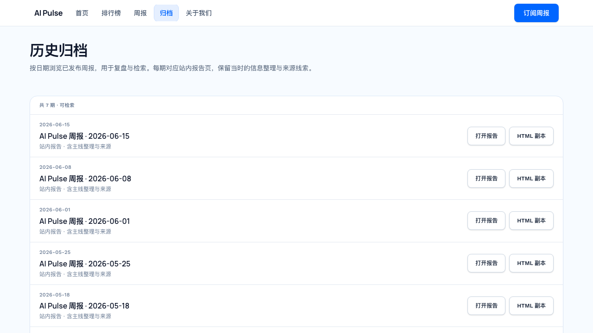
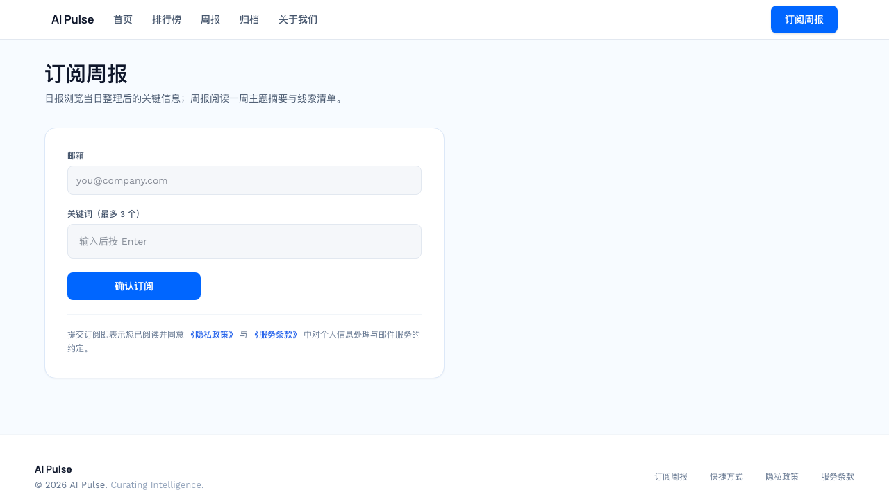
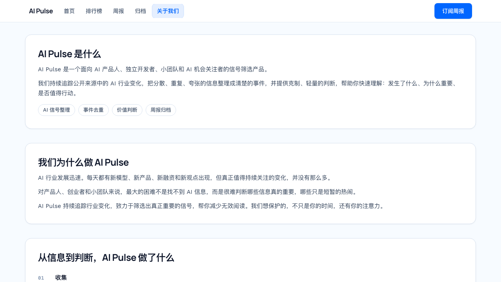
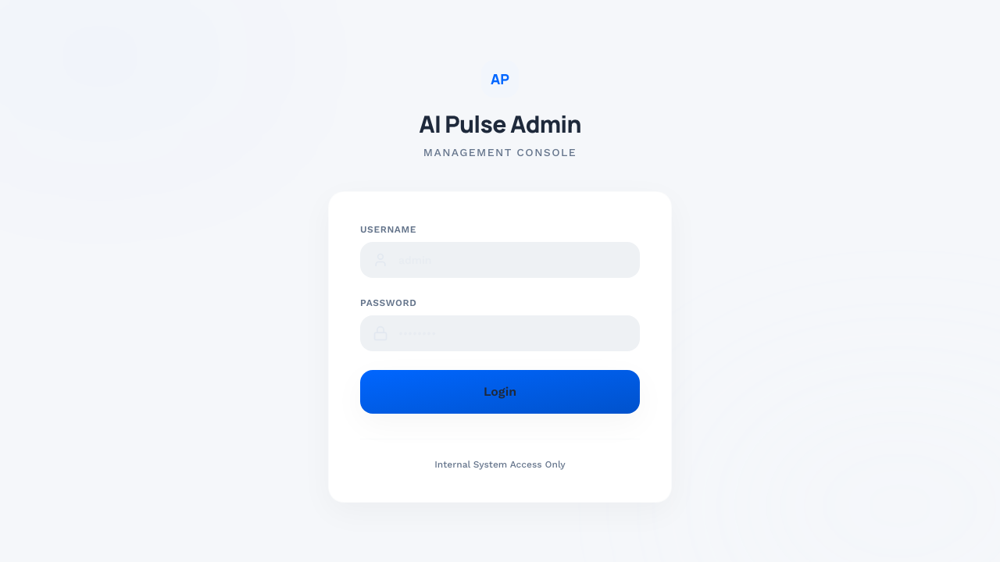

# AI Pulse 使用说明

这份文档面向第一次打开 AI Pulse 的读者、开发者和维护者，说明前端每个主要页面的用途、入口和典型使用路径。截图基于线上站点 `https://www.aipulse.asia`，截取时间为 2026-06-20。

## 页面总览

| 页面 | 路由 | 主要用途 |
| --- | --- | --- |
| 首页 | `/` | 展示今日重点信息、今日 Top 5 和进入榜单/周报/订阅的快捷入口。 |
| 排行榜 | `/rankings` | 按时间范围、分类和关键词筛选 AI 事件，查看 Pulse Score 排序结果。 |
| 事件详情 | `/events/:eventId` | 查看单个事件的中文摘要、评分依据、能力标签、来源和同类相关事件。 |
| 最新周报 | `/weekly/latest` | 打开最近一期周报，按周总结关键判断和重要事件。 |
| 指定周报 | `/weekly/:date` | 打开某个日期对应的历史周报，通常从归档页进入。 |
| 归档 | `/archive` | 按日期浏览已发布周报，也可复制周报 HTML 副本。 |
| 订阅 | `/subscribe` | 填写邮箱和关键词偏好，订阅每周邮件简报。 |
| 关于我们 | `/about` | 解释产品定位、信息处理思路、评分逻辑和使用边界。 |
| 隐私政策 | `/privacy` | 说明订阅、邮件和站点使用中的个人信息处理方式。 |
| 服务条款 | `/terms` | 说明服务使用约定、内容免责声明和联系渠道。 |
| 后台登录 | `/admin/login` | 管理后台入口，用于站点运营者登录。 |
| 后台内页 | `/admin/*` | 登录后查看订阅者、访问统计、反馈和运营数据。 |

订阅成功后的 `/subscribe/check-email` 和退订后的 `/subscribe/unsubscribed` 属于流程结果页，用户通常不会从导航栏直接进入。

## 首页



首页是普通访问者的第一屏，用来回答“今天最值得看的 AI 信号是什么”。页面顶部提供主导航和订阅入口，首屏左侧是产品一句话定位，右侧是今日重点信息卡片。往下是今日 Top 5 榜单预览，适合快速扫描当天最重要的事件。

常见操作：

- 点击“查看今日榜单”进入完整排行榜。
- 点击“订阅周报”进入邮箱订阅页。
- 点击今日重点信息里的“查看事件详情”进入单个事件详情页。

## 排行榜



排行榜页是日常阅读和检索的核心页面。它展示当前榜单更新时间、分类趋势、时间范围筛选、分类筛选、关键词搜索框和事件列表。每条事件都有 Pulse Score、来源、摘要、分类标签和“查看详情”入口。

适合的场景：

- 想知道今天、7 天内或 30 天内最重要的 AI 动态。
- 只看模型、工具、行业、开源等某一类事件。
- 用关键词搜索行业、场景或公司名，例如教育、电商、Agent、内容创作。

## 事件详情



事件详情页用于解释“这条信息为什么值得看”。页面会展示事件标题、英文原题、分类、发生日期、来源数量、主要来源、Pulse Score、现在试用/行动提示、评分依据、能力标签和同类相关事件。

适合的场景：

- 从榜单点进来，理解事件发生了什么。
- 判断事件的重要性、新鲜度、可信度和对自己的价值。
- 顺着来源或同类相关事件继续阅读。

## 最新周报



最新周报页面向“每周集中阅读”的用户。它会展示最近一期报告日期、本周判断、最重要的三件事、分主题梳理和关键线索。顶部导航里的“周报”默认进入 `/weekly/latest`。

适合的场景：

- 每周快速复盘 AI 行业主线。
- 给团队同步本周最值得关注的三件事。
- 从周报里的事件继续跳转到事件详情页。

## 归档



归档页按日期列出已经发布的周报。每一期都提供“打开报告”和“HTML 副本”，适合回看历史判断、检索旧报告，或者复制周报内容用于内部流转。

适合的场景：

- 找某一周的 AI 行业总结。
- 对比不同时期的行业主线变化。
- 复制 HTML 版本做邮件、知识库或其他渠道分发。

## 订阅



订阅页用于收集邮箱和最多 3 个关键词偏好。提交后，系统会发送确认邮件；开启 `MAIL_DRY_RUN=true` 时，本地开发环境可以先验证流程而不真实发信。

适合的场景：

- 让读者订阅每周 AI 简报。
- 用关键词偏好做后续个性化邮件或订阅管理扩展。
- 从页脚访问隐私政策和服务条款。

## 关于我们



关于页解释 AI Pulse 的产品定位和处理思路：从公开信息收集开始，经过去重、价值判断、评分和周报归档，把分散信息整理成更容易行动的信号。这个页面适合作为开源项目的产品说明，也适合给新用户理解“项目为什么这样做”。

适合的场景：

- 对外介绍 AI Pulse 的理念和边界。
- 解释评分、去重和周报归档的基本逻辑。
- 给开源贡献者了解项目目标。

## 后台登录



后台登录页是运营管理入口。登录后可以进入 `/admin` 下的管理页面，查看订阅者、统计、反馈和订阅者详情。后台账号需要由服务端脚本创建，生产环境必须设置强密码和强 `ADMIN_JWT_SECRET`。

常见维护操作：

```bash
cd backend
ADMIN_USERNAME=admin ADMIN_PASSWORD=change_me python scripts/create_admin_user.py
```

## 常见使用路径

1. 快速看今天重点：打开首页，查看今日重点信息和 Top 5，再进入排行榜。
2. 深入理解单个事件：在排行榜点击“查看详情”，阅读摘要、评分依据、来源和同类相关。
3. 每周复盘：打开“周报”，阅读本周判断和 Top 3，再从归档页回看历史报告。
4. 订阅邮件：进入“订阅周报”，填写邮箱和关键词，按邮件提示完成确认。
5. 运营维护：进入 `/admin/login`，登录后查看订阅者、访问统计和用户反馈。

## 本地运行提示

前端默认通过 Vite 代理访问本地后端。开发时通常按下面顺序启动：

```bash
npm install
cp .env.example .env
npm run dev
```

另开一个终端启动后端：

```bash
cd backend
python3 -m venv .venv
source .venv/bin/activate
pip install -r requirements.txt
cp .env.example .env
python -m uvicorn app.main:app --reload --host 127.0.0.1 --port 8000
```

最小本地后端配置可参考根目录 `README.md` 的 Quick Start。准备开源或部署前，重点检查 `.env`、数据库地址、SMTP 密钥、LLM API Key、后台密钥和私有图片资产不要提交到仓库。
