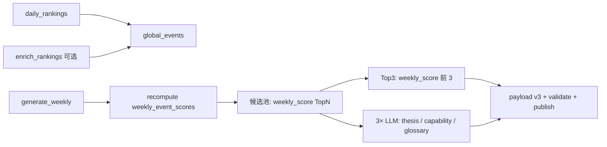
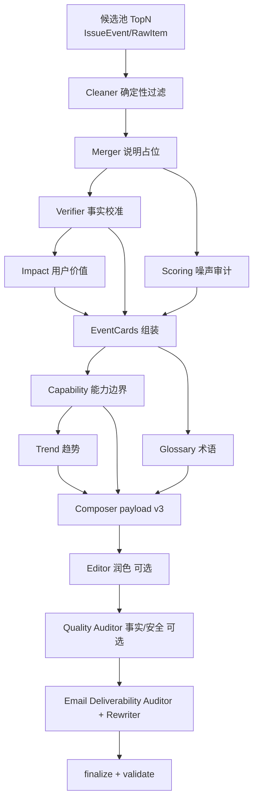

# 周刊生产架构实现笔记（内部/历史）

> 这份文档包含当前周刊实现背景和较多 legacy 多 Agent 历史内容。开源读者建议优先阅读 [`../PIPELINE_AND_OBSERVABILITY.md`](../PIPELINE_AND_OBSERVABILITY.md)；本文件仅供维护者回溯实现取舍。

**唯一生产入口**：`python -m app.jobs.generate_weekly`（`WEEKLY_SOURCE=global_events`，配置默认已是该值）。

实现：`backend/app/services/weekly_global_pipeline.py` + `backend/app/jobs/generate_weekly.py`。

---

**已停用（勿配置）**：`WEEKLY_SOURCE=legacy` 每期 RSS + `MultiAgentOrchestrator` 全量多 Agent。`generate_weekly` 遇到 legacy 会直接报错退出。旧方案说明与 DAG 见 **[`../archive/LEGACY_WEEKLY_MULTI_AGENT.md`](../archive/LEGACY_WEEKLY_MULTI_AGENT.md)**；代码仍保留在 `multi_agent_orchestrator.py` 仅供对照。

下文 **§0** 为当前生产说明；**§1–§7** 为历史文档（与 archive 同步，不再维护）。

## 0. 生产路径：基于日榜的 `weekly_global_slim`（推荐）

### 0.1 产品定位

- **日榜**：`daily_rankings` 每日写入 `global_events`，`enrich_rankings` 可选写入 Ranking Insight（事件详情页解读）。
- **周刊**：不再每期重抓 RSS、不再对全量候选跑 Impact / EventCards / Composer sections；而是在 **上一自然周**（发行周一对应的 `period_start` 往前 7 天～发行周一前一日）的 `global_events` 上二次分析，页面只展示四块：
  1. **本周判断**（`weekly_thesis.headline`，前端不展示长 `summary`）
  2. **Top3**（`normal.top3`，`event_id` → `/events/:id`）
  3. **能力边界**（`capability_boundaries`）
  4. **术语**（`glossary`）

### 0.2 数据流与选题



| 环节 | 说明 |
|------|------|
| 内容时间窗 | 发行日 = 本周一 `period_start`；事件须 `last_seen_at` 落在 **上周一 00:00～本周一 00:00（上海，不含）**（即上周一至上周日） |
| 候选池 | `select_global_events_by_weekly_score`：按 **`weekly_score` 降序**，上限 `GLOBAL_EVENTS_POOL_LIMIT`（默认 40） |
| Top3 | **`weekly_score` 前 3**（`build_normal_top3_payload_rows`）；展示字段与日榜一致（来源、中英文标题、对你意味着什么）；**不跑 Impact Analyst** |
| LLM | **3 次**：`weekly_thesis`、`capability_boundaries` 基于候选池 `pool_compact`；**`glossary` 仅基于 Top3 三条**（`top3_for_glossary`） |
| 已停用 | Impact、EventCards、Trend、Composer 的 `sections` / `category_recap` / `tools` / `noise` 等（省 token） |
| 审核 | `finalize_payload_v3`、`validate_payload`、`weekly_quality_v2_audit`；可选邮件 **Deliverability**（与 legacy 相同开关） |

入口：`python -m app.jobs.generate_weekly` 在 `WEEKLY_SOURCE=global_events` 且 `MULTI_AGENT_WEEKLY=true` 时调用 `build_global_weekly_payload`；`audit_report_YYYY-MM-DD.json` 中 `weekly_quality_summary.mode` = `weekly_global_slim`。

`MULTI_AGENT_WEEKLY=false` 时仍走 global 路径，但 **thesis 等不走 LLM**（thesis 用确定性兜底；Top3 仍为分数前 3）。

审计：`audit_report_*.json` 内 **`top3_selection.method`** = `weekly_score_top3`。

### 0.3 环境变量（与 `backend/.env.example` 一致）

```env
WEEKLY_SOURCE=global_events
MULTI_AGENT_WEEKLY=true
GLOBAL_EVENTS_LOOKBACK_DAYS=7
GLOBAL_EVENTS_POOL_LIMIT=40
GLOBAL_EVENTS_MIN_CANDIDATES=8
```

前置：本周内已跑过 `daily_rankings`（表 `global_events` 有数据）。操作命令见 [`../command.md`](../command.md)「周刊生成」小节。

**Insight 与周刊正文**：周刊 Top3 **不另跑 Impact LLM**；卡片上的「发生了什么 / 对你意味着什么」等来自日榜 **`enrich_rankings`**（Ranking Insight）已写入的 `global_events` 字段。Insight 限额未覆盖的事件仍可能进 Top3，但文案偏短。详见 [`../SCORE_AND_RANKING.md`](../SCORE_AND_RANKING.md) §5。

**`published_at` 首发日**：合并多源时 `global_events.published_at = min(各来源)`；跟进报道只抬 `source_count` / Pulse，不把日期刷成最新稿。旧库若仍是改代码前的 max 日期，需批量重算，见 [`../command.md`](../command.md)。

### 0.4 已移除的生产路径（仅档案）

| 项 | 说明 |
|----|------|
| `WEEKLY_SOURCE=legacy` | **已从 `generate_weekly` 移除**；见 archive 文档 |
| `python -m app.jobs.build_weekly_multi_agent` | **已停用**（exit 2） |
| `top3_selector.select_top3`（周刊） | 仅 legacy 编排使用；生产 Top3 = `weekly_score` 前 3 |
| `resolve_global_weekly_top3_rows`（LLM 选 Top3） | 代码存在，**未接生产** |

---

## 0.6 目标与约束（通用）

- **输入（global）**：过去 N 天 `global_events` + `weekly_event_scores`；**输入（legacy）**：本周期 RSS/issue_events 候选 Top20。
- **输出**：
  - `payload.json`：用于邮件渲染的结构化周报（simple/normal/glossary）
  - `audit_report.json`：审计报告（事实冲突、可信度风险、重复合并、评分异常）
- **约束**：
  - 只允许“结构化改写”，不允许无依据的新增事实（每个事实必须可追溯到 source URL）
  - 生成速度优先于完美：允许少量信息缺失，但必须在 audit_report 标注

相关文档：

- **分数与榜单口径（权威）**：[`../SCORE_AND_RANKING.md`](../SCORE_AND_RANKING.md)
- raw 入库 6 维规则分：[`../SCORING_V1.md`](../SCORING_V1.md)（≠ Pulse / weekly_score）
- 社媒白名单：[`../SOCIAL_SOURCES.md`](../SOCIAL_SOURCES.md)

## 1. 总体流程（legacy 每周批处理）【历史 · 已停用】

> **不要按本节操作。** 当前生产见 **§0**。Legacy 详情见 [`../archive/LEGACY_WEEKLY_MULTI_AGENT.md`](../archive/LEGACY_WEEKLY_MULTI_AGENT.md)。

1) **Ingest + Normalize**（抓取与标准化）
   - 产出 `raw_items` 或 `event_candidates`（建议已去重/合并成事件实体）
2) **Score + Candidate Select**（评分与候选池）
   - 按基础分 \(S\) 排序，选出候选 **Top20**
3) **并行 Agent 处理（多工种）**
4) **Orchestrator 合并组装**（模板化组装 payload）
5) **Copy Editor 收口**（语言统一、长度约束、格式）
6) **产出 payload + audit_report**

### 1.1 依赖关系（DAG，仅 legacy）

与 **PRD §6.3** 对齐的实现（代码：`backend/app/services/multi_agent_orchestrator.py`）。抓取与 **IssueEvent** 合并在入库阶段完成，流水线从 Cleaner 起。**`WEEKLY_SOURCE=global_events` 时不执行此 DAG**，见 `backend/app/services/weekly_global_pipeline.py`。



> **Composer（实现更新）**：LLM 只输出「精简结构化 JSON」（`simple_lines` / `top3` / `sections` / `tools` / `glossary`）；**不写**嵌套巨型 PRD blob。**capabilities** 由上游 Capability 分析在服务端注入（`slim_weekly_render.slim_merge_to_prd_v3`）。邮件 HTML 仍由 **`digest_builder.render_issue_email`** 确定性渲染。**送达率审核**优先基于「渲染后的 HTML + 纯文本节选」，而非整份 payload JSON。

> 说明：**Cleaner** 为 Python 规则；**Merger** 不在此二次合并（见 `artifacts.merger`）。**Capability** 独立 LLM；**Composer** 生成整份 PRD v3；**Editor**（`MULTI_AGENT_ENABLE_EDITOR`）与 **Quality Auditor**（`MULTI_AGENT_ENABLE_AUDITOR`，事实与编造风险）默认均为关。**Email Deliverability**（`MULTI_AGENT_ENABLE_DELIVERABILITY`，默认 **开启**）：链接清洗（去常见 tracking 参数）后，用 **`render_issue_email` 预览 HTML/纯文本** 再做 LLM 送达率审核与按需改写；详见 `app/services/deliverability_pipeline.py`。若开启 **`MULTI_AGENT_DELIVERABILITY_STRICT`**（默认 true）且改写后仍低于 `MULTI_AGENT_DELIVERABILITY_MIN_SCORE` 或仍为 high risk，则整包回退为确定性组装。

## 2. 核心理念：事件卡片（Event Card）

组装式的最小单元是“事件卡片”，它不是一段自由文章，而是可验证的结构化信息。

### 2.1 EventCard（输出最小结构）

```json
{
  "event_id": "string",
  "title": "string",
  "url": "string",
  "published_at": "ISO-8601 string or null",
  "one_liner": "一句话：发生了什么（<= 40 中文字优先）",
  "impact_bullets": ["对谁有什么影响（2-3条）"],
  "evidence": [
    { "label": "official|social|github|media", "url": "string", "quote": "可引用句（可空）" }
  ],
  "confidence": {
    "level": "high|medium|low",
    "reasons": ["trusted_account", "official_post", "multi_media", "single_source", "rumor_risk"]
  },
  "score": {
    "base_S": 0,
    "impact_detail": { "social": 0, "github": 0, "consensus": 0 },
    "notes": ["score notes..."]
  },
  "tags": ["model_update|product_launch|policy|infra|open_source|..."]
}
```

> 说明：证据 `evidence` 至少包含 1 个 URL；若无法提供 quote，可为空但仍需 URL。

## 2.2 最终交付物：payload.json（严格 schema）

最终的 `payload.json` 必须与邮件渲染层的结构一致（simple/normal/glossary），避免“渲染层猜字段”。

```json
{
  "simple": {
    "lines": [
      { "text": "一句话事件（不超过约 300 字）", "url": "https://..." }
    ],
    "footer": "本周一句话总结（可选）"
  },
  "normal": {
    "top3": [
      { "title": "热点标题", "url": "https://..." }
    ],
    "sections": [
      { "title": "大模型更新|AI工具/产品发布|行业重要动态", "paragraph": "多行文本，允许换行" }
    ]
  },
  "glossary": [
    { "term": "术语", "explain": "≤50字通俗解释" }
  ]
}
```

约束：

- `simple.lines`：3–5 条（推荐 5），每条一句话为主，必须带 `url`（若无则空字符串）。
- `normal.top3`：固定 3 条。
- `normal.sections`：固定 3 个板块（标题必须落在三选一；无内容则允许为空数组，但不推荐）。
- `glossary`：5–12 条。

> 注：关键词提示语（banner）属于“邮件包装层”元信息，不建议写入 payload.json；由发送端根据 matched/not matched 决定。

## 3. Agent 分工（最小有效 6 角色）

### Agent A：Fact Verifier（事实校准）

- **输入**：候选事件列表（Top20）+ 其来源 URL（官网/社媒/媒体/GitHub）
- **输出**：`fact_sheet.json`
- **职责**：
  - 核对关键事实：发布时间、产品/模型名称、是否 GA/beta、关键数字是否一致
  - 标注 `confidence.level` 与原因
  - 发现冲突时，写入 `conflicts[]`（不自行编造结论）

`fact_sheet.json` 示例结构：

```json
{
  "events": [
    {
      "event_id": "string",
      "canonical_title": "string",
      "canonical_url": "string",
      "verified_facts": ["..."],
      "confidence": { "level": "high|medium|low", "reasons": ["..."] },
      "conflicts": [{ "field": "string", "details": "string", "urls": ["..."] }]
    }
  ]
}
```

### Agent B：Impact Analyst（非技术影响解读）

- **legacy**：见下述职责。
- **global_events / weekly_global_slim**：**已移除**；Top3 按 `weekly_score` 取前 3，正文由 `build_normal_top3_payload_rows` 从日榜字段组装。

- **输入**：fact_sheet + Top20 事件摘要
- **输出**：`impact_notes.json`
- **职责**：
  - 生成每条事件 `one_liner` + 2-3 条 `impact_bullets`
  - 语气面向非技术职场人，避免技术细节堆砌

### Agent C：Scoring Auditor（评分审计/异常检测）

- **输入**：Top20 评分拆解 + 信号字段
- **输出**：`scoring_findings.json` 
- **职责**：
  - 检查是否存在“噪音霸榜”：低可信账号热度极高但缺少共识
  - 检查重复事件：同事件多条来源未合并
  - 输出“建议降权/剔除/合并”的规则化建议（不直接改内容）

### Agent D：Trend Synthesizer（趋势归纳）

- **legacy**：独立 Trend Agent，产出 `trend_section.json`。
- **global slim**：**本周判断**由主编 LLM 写入 `weekly_thesis`（`headline` + 可选 `trend_lines`），不再单独跑 Trend Agent。

- **输入**：Top20 EventCard 草稿 + 评分/信号
- **输出**：`trend_section.json`
- **职责**：
  - 提炼 1–3 个趋势结论（每个趋势至少引用 2–3 个事件作为证据）
  - 给出“普通人/企业”的意义解读

### Agent E：Glossary Builder（术语表）

- **输入**：normal 版草稿（或 EventCard 汇总文本）
- **输出**：`glossary.json`
- **职责**：
  - 5–12 个术语，每条 ≤50 字解释
  - 避免“百科式”，以“这周为什么要知道它”为导向

### Agent F：Copy Editor（语言与结构收口）

- **输入**：Orchestrator 组装后的 payload 草稿 + audit findings
- **输出**：`payload.json`
- **职责**：
  - 统一语气、去重、修正不通顺表达
  - **不允许改事实**：涉及事实的句子只能在已验证事实范围内改写
  - 约束长度：
    - simple：3–5 条（建议 5），每条一句话
    - normal：Top3 + 3 个板块（大模型更新 / 工具产品 / 行业动态）

## 4. Orchestrator（合并与仲裁规则）

### 4.1 合并原则

- 以 `event_id` 为主键合并各 Agent 输出
- 任何事实字段必须来自 Fact Verifier 或 evidence URL

### 4.2 冲突仲裁

当出现冲突（A 与 B/D 观点不一致）：

1) **事实冲突优先**：以 Agent A 的 verified_facts 为准
2) **不确定则降级**：
   - `confidence=low` 的事件不得进入 normal Top3
   - 可以进入 sections，但必须标注“信息待验证/以官方后续为准”（一句话内）
3) **无法校准则剔除**：若核心事实无法验证且争议大，移出 TopN

### 4.3 TopN 选择

- **global_events（推荐）**：候选池与 Top3 均按 **`weekly_score`**；`event_id` 必须为真实 `global_events.id`。
- **legacy**：
  - **候选池**：Top20（按基础分 S）
  - **Simple**：从 Top20 选 5 条（可结合“关键词优先”逻辑）
  - **Normal Top3**：从 Top20 选 3 条，要求 `confidence != low`
  - **Sections**：按 tags 分类填充（每段 3–5 条卡片）

## 5. Prompt 模板（可复用骨架）

> 这里给出“可直接用”的骨架，具体字段可根据实现调整。

### Fact Verifier Prompt（骨架）

- 输入：Top20 事件（title/summary/url）+ 可访问链接列表
- 输出：严格 JSON，包含 verified_facts/confidence/conflicts
- 规则：不得编造；引用必须来自链接；不确定写 conflicts

### Impact Analyst Prompt（骨架）

- 输入：fact_sheet + 事件摘要
- 输出：每条 event 的 one_liner + impact_bullets
- 规则：非技术表达；避免过度承诺；控制句长

### Trend Synthesizer Prompt（骨架）

- 输入：事件卡片集合（含 tags 与 one_liner）
- 输出：1–3 个趋势，每个趋势列出证据 event_id

### Copy Editor Prompt（骨架）

- 输入：组装后的 payload 草稿
- 输出：最终 payload.json（严格 JSON）
- 规则：不改事实、只改表达；满足结构与长度约束

## 6. 质量门槛（自动验收）

- JSON 可解析、字段齐全
- simple lines 数量在 3–5
- normal Top3 数量 = 3
- glossary 术语数量 5–12，单条解释 ≤50 字（中文字符近似）
- audit_report 中不得出现未处理的 high-severity 冲突

## 7. 失败降级策略（保证每周可出报）

任何单个 Agent 失败都不应阻断整条流水线（除非基础抓取/评分全失败）。

- **Agent A 失败**：直接将所有事件 `confidence=low`，normal Top3 从候选中选“来源覆盖最多”的 3 条；audit_report 标记“未校准事实”。
- **Agent B 失败**：`one_liner` 退化为 “title（url）”，`impact_bullets` 留空或用模板句；Copy Editor 负责语气统一。
- **Agent C 失败**：跳过审计，但保留“低可信上限、时效衰减”等硬规则；audit_report 标记“未审计评分异常”。
- **Agent D 失败**：趋势段落可省略或用 1 句“本周趋势以实用化/工具化为主（待补充）”占位。
- **Agent E 失败**：术语表可降级为 0–3 条（从标题中抽取高频术语），并在 audit_report 标记“术语表未完善”。
- **Agent F 失败**：由 Orchestrator 直接输出 payload 草稿（不做润色），但必须保证 JSON 可解析、结构合规。
